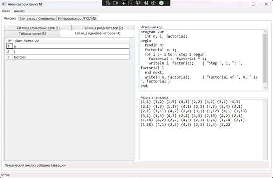
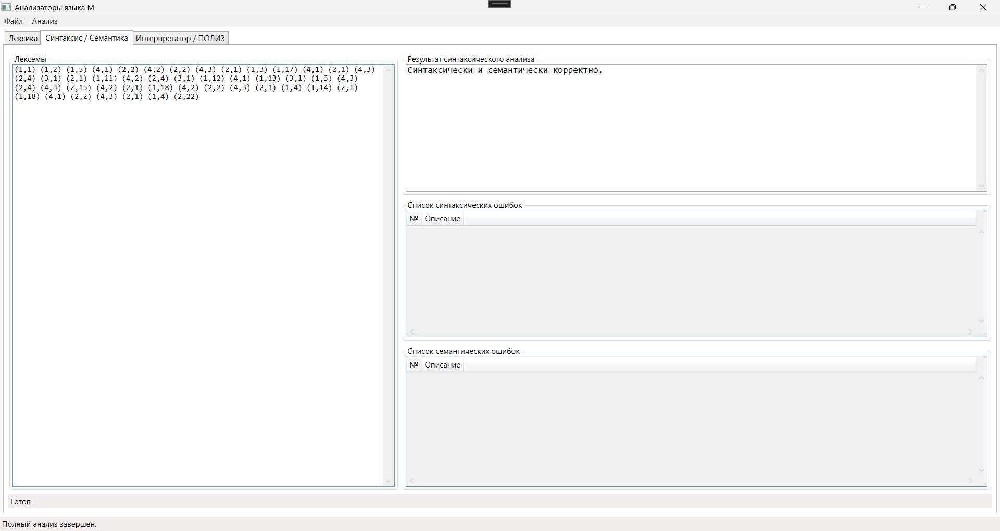
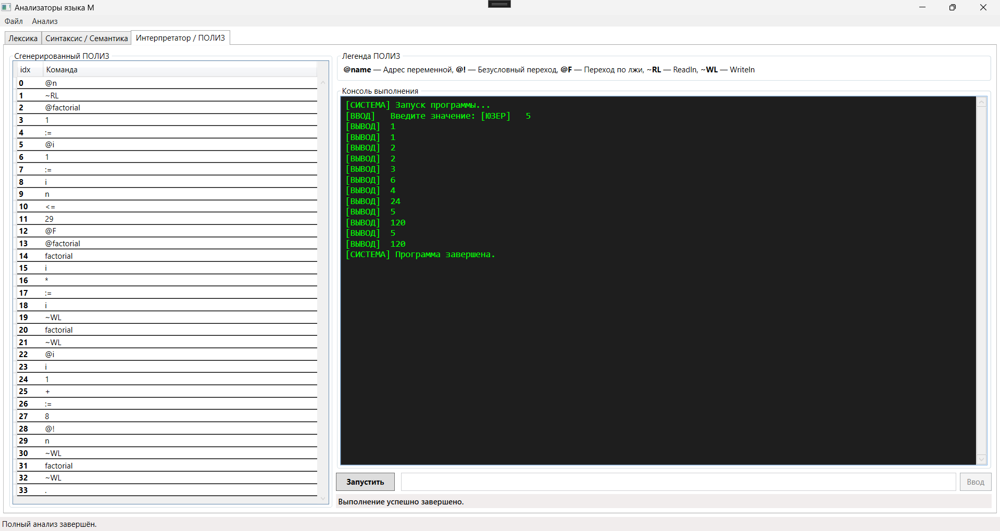
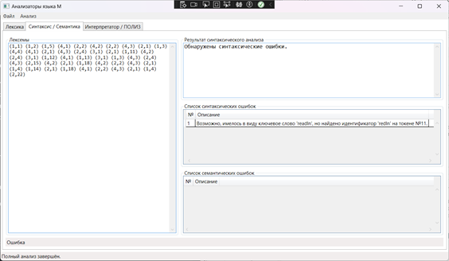

<h1 align="center">Учебный компилятор модельного языка «М»</h1>

<p align="center">
  
  
  
</p>

<p align="center">
  <strong>Компилятор и интерпретатор Паскаль-подобного языка «М».</strong><br>
  Разработан в рамках курсовой работы по дисциплине «Теория языков программирования и методы трансляции».
</p>

---

## 📖 О проекте

Проект представляет собой программное средство для изучения принципов построения трансляторов. Система реализует все классические этапы обработки исходного текста: от лексического анализа на основе конечных автоматов до выполнения промежуточного кода на виртуальной стековой машине.

### Технический стек:
- **Core:** .NET 8.0 (C# 12)
- **UI:** WPF (Windows Presentation Foundation)
- **Архитектура:** MVVM (Model-View-ViewModel)

---

## 📺 Обзор интерфейса и этапов трансляции

### 1. Лексический анализ (ЛА)
Текст программы преобразуется в последовательность токенов. 
- **Реализация:** Детерминированный конечный автомат (ДКА) с **29 состояниями** (схема ДКА находится по пути `CourseWork_Prog_Lang_Compiler/Assets/Screenshots/fsm_diagram.png`).
- **Особенности:** Распознавание чисел в 2, 8, 10 и 16-ричных системах счисления (суффиксы `B`, `O`, `D`, `H`), поддержка экспоненциальной записи (`1.5E-2`) и обработка многострочных комментариев `{ ... }`.
<p align="center">
  
</p>

### 2. Синтаксический и Семантический анализ
- **Синтаксис:** Метод **рекурсивного спуска** для нисходящего разбора.
- **Семантика:** Проверка типов (`int`, `float`, `bool`), контроль описания переменных перед использованием и уникальности имен в области видимости.
<p align="center">
  
</p>

### 3. Генерация ПОЛИЗ и Интерпретация
Программа переводится в промежуточное представление — **ПОЛИЗ** (Польская инверсная запись), которое затем выполняется стековым интерпретатором.
- **Среда выполнения:** Эмуляция консоли с поддержкой операторов ввода `readln` и вывода `writeln`.
- **Безопасность:** Защита от бесконечных циклов (лимит 1 000 000 инструкций).
<p align="center">
  
</p>

### 4. Продвинутая диагностика ошибок
Приложение оснащено многоуровневой системой обработки исключений. 
- **Расстояние Лавенштейна:** При обнаружении неизвестного идентификатора система ищет наиболее близкое ключевое слово и предлагает его в качестве исправления.
<p align="center">
  
</p>

---

## 🔥 Функциональные возможности языка «М»

Язык поддерживает основные конструкции программирования:
- **Типы данных:** Целые (`int`), вещественные (`float`), логические (`bool`).
- **Операторы:** Присваивание (`:=`), ввод/вывод (`readln`, `writeln`).
- **Управляющие структуры:** 
  - Условный оператор `if (условие) оператор [else оператор]`.
  - Цикл с пред условием `while (условие) оператор`.
  - Фиксированный цикл `for присваивание to выражение [step выражение] оператор next`.
- **Блоки:** Составной оператор `begin ... end`.

---

## 📝 Пример кода

Вычисление факториала числа `n`:
```pascal
program var
  int n, i, factorial;
begin
  readln n;
  factorial := 1;
  for i := 1 to n step 1 begin
    factorial := factorial * i;
    writeln i, factorial; { вывод шага и текущего значения }
  end next;
  writeln factorial;
end.
```

---

## 🚀 Структура решения

- **Assets/Screenshots** — снимки экрана для документации.
- **Models/** — «ядро» компилятора:
  - `LexicalAnalyzer.cs` — логика ДКА.
  - `SyntaxAnalyzer.cs` — парсер и генератор ПОЛИЗ.
  - `SemanticAnalyzer.cs` — проверка типов и таблиц символов.
  - `Interpreter.cs` — стековая машина.
- **ViewModels/** — логика взаимодействия UI и моделей.
- **Views/** — XAML-интерфейсы.

---

## 🛠 Установка и запуск

1. **Требования:** Visual Studio 2022 и установленная нагрузка «Разработка классических приложений .NET».
2. **Клонирование:**
   ```bash
   git clone https://github.com/Ivan-Salikov/CourseWork_Prog_Lang_Compiler.git
   ```
3. **Запуск:** Откройте `CourseWork_Prog_Lang_Compiler.sln` и нажмите **F5**.
