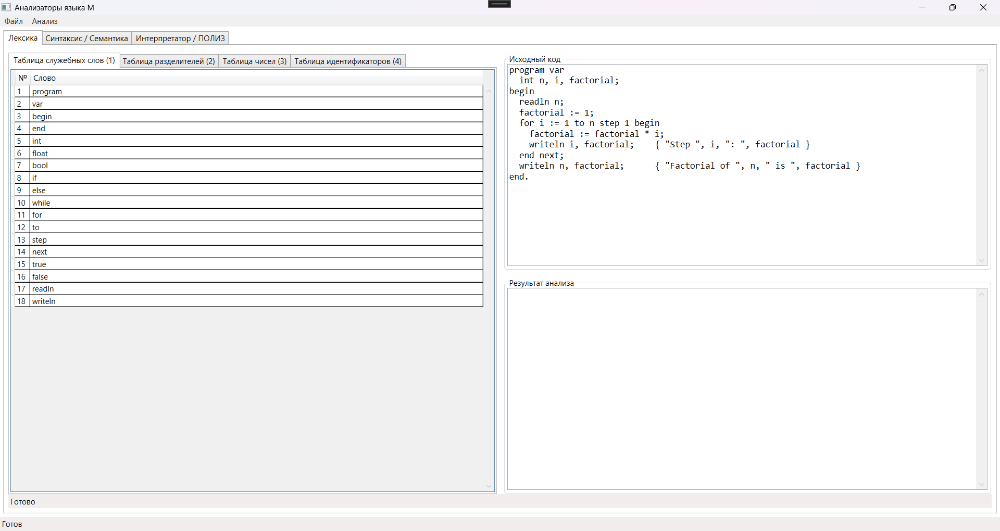

# Учебный компилятор для модельного языка М

[](https://docs.microsoft.com/en-us/dotnet/csharp/)
[](https://dotnet.microsoft.com/en-us/)
[](https://docs.microsoft.com/en-us/dotnet/desktop/wpf/)

Компилятор для модельного, Паскаль-подобного языка, написанный с нуля на C#. Интерфейс реализован на WPF с использованием архитектурного паттерна MVVM. Проект охватывает полный конвейер компиляции: от лексического анализа до генерации кода.



---

## О проекте

Данный проект является курсовой работой, целью которой является практическая реализация основных этапов создания компилятора. Разработка ведется для кастомного, статически типизированного языка "М", синтаксис которого основан на языке Pascal.

Проект демонстрирует применение теории формальных грамматик и конечных автоматов для решения прикладной задачи.

### Технологический стек

*   **Язык:** C# 11.0
*   **Платформа:** .NET 8.0
*   **Интерфейс:** Windows Presentation Foundation (WPF)
*   **Архитектура:** Model-View-ViewModel (MVVM)

---

## Реализованный функционал

### Этап 1: Лексический анализ (✔️ Завершено)

На данном этапе был реализован лексический анализатор (сканер), который преобразует исходный код в последовательность лексем (токенов).

**Ключевые возможности анализатора:**

*   **Основан на конечном автомате:** Вся логика реализована в классе `LexicalAnalyzer` как детерминированный конечный автомат (ДКА), строго следующий предоставленной диаграмме состояний.
*   **Распознавание всех типов лексем:**
    *   Идентификаторы
    *   Служебные слова
    *   Разделители (одно- и двухсимвольные)
    *   Комментарии вида `{ ... }`
*   **Продвинутый разбор чисел:**
    *   Поддержка различных систем счисления:
        *   **Двоичная** (суффикс `B`, например, `101b`)
        *   **Восьмеричная** (суффикс `O`, например, `127o`)
        *   **Десятичная** (суффикс `D` или без него, например, `199d` или `199`)
        *   **Шестнадцатеричная** (суффикс `H`, например, `1AFh`)
    *   Корректный разбор действительных чисел и чисел в экспоненциальной нотации (например, `1.23`, `4.56E-7`).
*   **Обработка неоднозначностей:** Реализован механизм "заглядывания вперед" для разрешения конфликтов, когда один и тот же символ может быть и суффиксом, и частью числа (например, `d` в `123d` (десятичное) и в `123dh` (шестнадцатеричное)).
*   **Отчеты об ошибках:** Анализатор обнаруживает лексические ошибки и выводит информативное сообщение с точным указанием строки, на которой произошла ошибка.
*   **Визуализация:** Результаты работы (список токенов, таблицы идентификаторов и чисел) полностью интегрированы с интерфейсом WPF и обновляются после каждого анализа.

---

## Начало работы

Для запуска проекта на локальной машине выполните следующие шаги.

### Требования

*   [.NET 8.0 SDK](https://dotnet.microsoft.com/download/dotnet/8.0)
*   Visual Studio 2022 (с установленным набором для разработки .NET Desktop)

### Установка и запуск

1.  Клонируйте репозиторий:
    ```sh
    git clone https://github.com/ваш-логин/ваш-репозиторий.git
    ```
2.  Откройте файл решения `CourseWork_Prog_Lang_Compiler.sln` в Visual Studio.
3.  Нажмите `F5` для сборки и запуска проекта.
